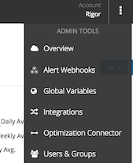
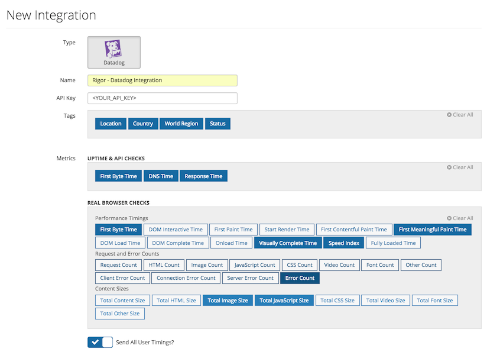
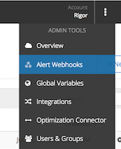
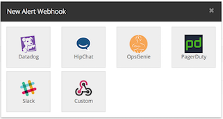
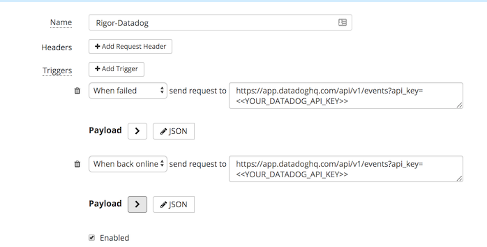
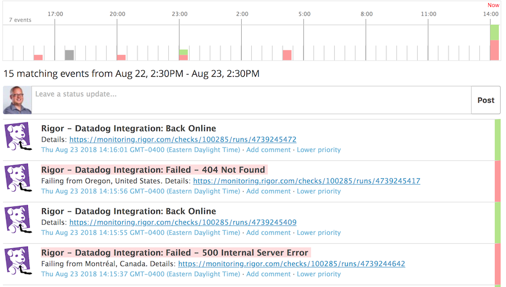

## Overview
Rigor provides synthetic monitoring and optimization insights throughout your development 
lifecycle.

With Rigor, you can collect synthetic, front-end performance metrics and push those 
metrics into Datadog.  You can also push alerts into Datadog as events.

## Setup

Rigor has two different integrations with Datadog, a metrics integration and an events 
integration.

### Configuring Metrics Integration
As an administrator, click the "Admin Tools" menu in the upper right hand of your 
screen and select "Integrations".

Add a new integration, by clicking the "New" button.  You will now be able to configure 
the integration.

Add a unique name for this integration and your API key from Datadog.  Then choose which 
tags and metrics you want to send. Some things to remember:
- We include a normalized version of the check name as a default tag
- For multi-step checks (Real Browser and API Checks), we include the position of the 
  request that the metrics came from
- Uptime checks include HTTP, Port, and API checks
- Port checks only report the "Response Time" metric
- Not all browsers support all metrics

If you would like Real Browser Checks to report timings from the 
[User Timings API][mozilla], 
make sure "Send All User Timings?" is selected.  Any marks are reported under the 
`rigor.real_browser.marks` namespace and measures are reported under the 
`rigor.real_browser.measures` namespace. Be aware that selecting this option
could send a lot of new series into Datadog, especially if the marks and measures
on the site you are testing are dynamically generated. 

Once you have configured the integration.  You can add to any Real Browser, HTTP, Port,
or API check.  Just edit the check and go to the "Notifications" tab.  Here you can add
the integration that you just created.

### Configuring Events Integration
As an administrator, click the "Admin Tools" menu in the upper right hand of your 
screen and select "Alert Webhooks".

Add a new integration, by clicking the "New" button and clicking the Datadog tile.

Add a unique name for this webhook and make sure to update the triggers with your Datadog
API key.

Once you have configured the integration.  You can add to any Real Browser, HTTP, Port,
or API check.  Just edit the check and go to the "Notifications" tab.  Here you can add
the webhook that you just created.

### Metrics

Any of Rigor's metrics can be sent to Datadog.  The metrics that are actually sent depend
on how the integration was configured.  The possible metrics are:

#### HTTP Checks
- `rigor.http.dns_time`
- `rigor.http.first_byte_time`
- `rigor.http.response_time`

#### Port Checks
- `rigor.port.response_time`

#### API Checks
- `rigor.api.dns_time`
- `rigor.api.first_byte_time`
- `rigor.api.response_time`

#### Real Browser Checks
- `rigor.real_browser.first_byte_time_ms`
- `rigor.real_browser.dom_interactive_time_ms`
- `rigor.real_browser.first_paint_time_ms`
- `rigor.real_browser.start_render_ms`
- `rigor.real_browser.first_contentful_paint_time_ms`
- `rigor.real_browser.first_meaningful_paint_time_ms`
- `rigor.real_browser.dom_load_time_ms`
- `rigor.real_browser.dom_complete_time_ms`
- `rigor.real_browser.onload_time_ms`
- `rigor.real_browser.visually_complete_ms`
- `rigor.real_browser.speed_index`
- `rigor.real_browser.fully_loaded_time_ms`
- `rigor.real_browser.requests`
- `rigor.real_browser.content_bytes`
- `rigor.real_browser.html_files`
- `rigor.real_browser.html_bytes`
- `rigor.real_browser.image_files`
- `rigor.real_browser.image_bytes`
- `rigor.real_browser.javascript_files`
- `rigor.real_browser.javascript_bytes`
- `rigor.real_browser.css_files`
- `rigor.real_browser.css_bytes`
- `rigor.real_browser.video_files`
- `rigor.real_browser.video_bytes`
- `rigor.real_browser.font_files`
- `rigor.real_browser.font_bytes`
- `rigor.real_browser.other_files`
- `rigor.real_browser.other_bytes`
- `rigor.real_browser.client_errors`
- `rigor.real_browser.connection_errors`
- `rigor.real_browser.server_errors`
- `rigor.real_browser.errors`

Additionally, if the integration is configured, browser User Timings will be sent under the
`rigor.real_browser.marks` and `rigor.real_browser.measures` namespaces.

### Events

When a check is configured to alert via a Datadog event, 2 events types will be pushed
into Datadog:
- **Failed** - whenever the check fails enough to pass the threshold so that it sends an 
  alert
- **Back online** - whenever the check successfully runs while in an alerting state 

### Service Checks

The Rigor - Datadog integration does not include any service check.

### Troubleshooting
Need help? Contact [Rigor Support](mailto:support@rigor.com).

### Further Reading
Learn more about Rigor and how we can help make your website faster, visit 
[rigor][rigor].

[mozilla]: https://developer.mozilla.org/en-US/docs/Web/API/User_Timing_API
[rigor]: https://rigor.com